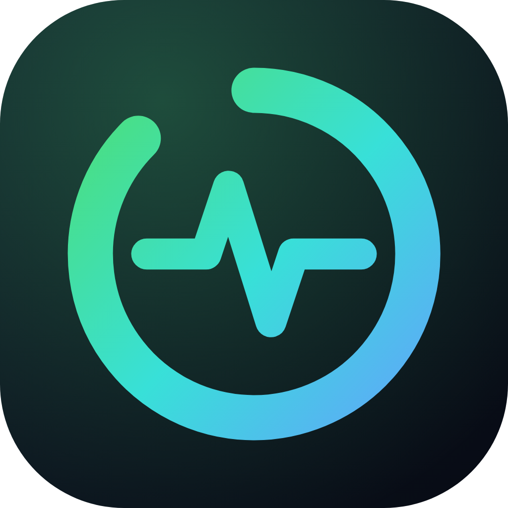
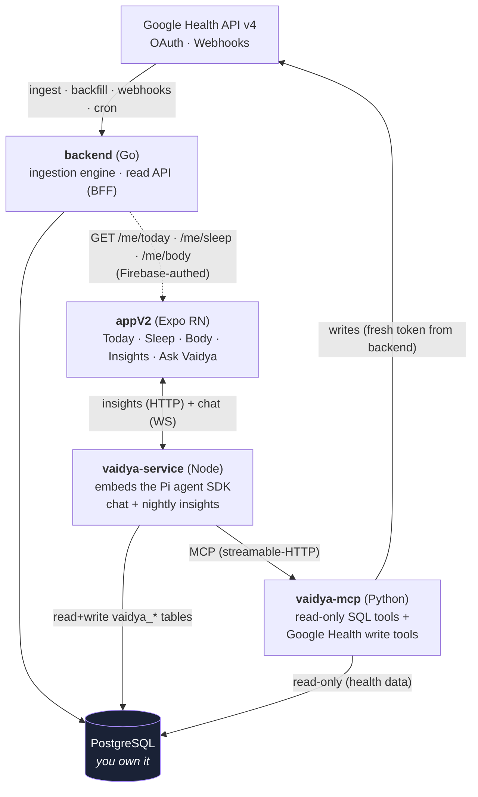

<div align="center">



# FitVibe

**An open-source, self-hostable health platform — ingest your Google Health data, own it in your own PostgreSQL, and talk to an AI coach grounded entirely in your own numbers.**

[](LICENSE)
[](backend/)
[](appV2/)
[](vaidya-mcp/)
[](vaidya-service/)

[Documentation](docs/) · [Architecture](docs/architecture.md) · [Backend](docs/backend.md) · [Mobile App](docs/app.md) · [Vaidya AI Coach](docs/vaidya.md)

</div>

---

## What is FitVibe?

FitVibe is a complete, self-hostable health-tracking system. It pulls your wearable and health data from the **Google Health API v4**, stores the lossless raw data in **your own PostgreSQL**, derives the metrics and scores a polished health app needs (readiness, sleep score, recovery trends), and serves them to a beautiful **Expo / React Native** app.

On top of that sits **Vaidya** — an AI health coach that answers questions and writes daily insights using *only your real data*, never fabricated numbers. Vaidya runs as its own service, so the rest of the platform works fine without it.

It is built to run on hardware you control — a small VPS or even a Raspberry Pi.

## Why

Your health data shouldn't live only in someone else's cloud behind a coaching paywall. FitVibe is the answer to "what if I owned the pipeline" — from OAuth and ingestion, through the exact formulas behind every score, to an AI coach whose system prompt you can read. Everything derived is [documented with its formula](docs/calculations.md), and the AI is grounded in tool results, not vibes.

## Architecture at a glance



See [`docs/architecture.md`](docs/architecture.md) for the full data flow, trust boundaries, and design rationale.

## The four services

| Service | Stack | Role |
|---------|-------|------|
| **[`backend/`](backend/)** | Go 1.25, pgx, Chi | OAuth, ingestion, webhooks, cron gap-fill, and the screen-shaped read API. The heart of the system. |
| **[`appV2/`](appV2/)** | Expo SDK 56, React Native 0.85 | The mobile app — Today, Sleep, Body, Insights, and the Ask Vaidya chat. |
| **[`vaidya-service/`](vaidya-service/)** | Node 22, TypeScript, [Pi SDK](https://pi.dev) | The AI coach engine — live chat over WebSocket and cron-generated daily insights. |
| **[`vaidya-mcp/`](vaidya-mcp/)** | Python 3.11, FastMCP | The agent's tools — read-only SQL over your health data + write-back to Google Health. |

Vaidya is optional: run just `backend/` + `appV2/` for a complete tracking app, and add the two Vaidya services when you want the AI coach.

## Quick start

> **Prerequisites:** [Go 1.25+](https://go.dev), [Docker](https://docker.com) (for local PostgreSQL), [Node 22+](https://nodejs.org), [Python 3.11+](https://python.org), and Google Cloud OAuth credentials with the Health API enabled. See [`docs/setup.md`](docs/setup.md) for the full walk-through including Google Cloud and Firebase setup.

### 1. Backend + database (the minimum to run)

```bash
cd backend
cp .env.example .env          # fill in your Google OAuth credentials
docker compose up -d          # local PostgreSQL (migrations apply on server start)
go run ./cmd/server           # starts on :8080
```

Authorize your first user and backfill history:

```bash
go run ./cmd/authlink                 # prints the Google consent URL
# complete consent; the app (or curl) exchanges the code at POST /auth/exchange
go run ./cmd/fetchbackfill -user 1    # backfill history from the Health API
```

### 2. Mobile app

```bash
cd appV2
cp .env.example .env          # point EXPO_PUBLIC_API_BASE_URL at your backend
npm install
npm run ios                   # or: npm run android  (a dev build — not Expo Go)
```

> The app needs a **dev/standalone build**, not Expo Go, because it uses native modules (Firebase, Skia, notifications). See [`docs/app.md`](docs/app.md).

### 3. Vaidya AI coach (optional)

```bash
# Terminal A — the MCP tool server
cd vaidya-mcp
cp .env.example .env                 # DATABASE_URL_READONLY for the read-only role
python -m venv .venv && .venv/bin/pip install -e .
psql "$DATABASE_URL" -f sql/role_provisioning.sql   # create the read-only role (once, as superuser)
python -m vaidya_mcp.server          # serves http://127.0.0.1:8765/mcp

# Terminal B — the coach engine
cd vaidya-service
cp .env.example .env
npm install && npm run dev           # serves :8090 (HTTP insights + chat WebSocket)
```

Full details for each service live in [`docs/`](docs/).

## Documentation

A complete documentation set lives in [`docs/`](docs/) — every document is provided as both **Markdown** (renders on GitHub) and an **enriched HTML** version (styled, with diagrams, great offline).

| Doc | What it covers |
|-----|----------------|
| [Architecture](docs/architecture.md) | System-wide data flow, services, trust boundaries, design decisions |
| [Setup guide](docs/setup.md) | End-to-end local setup: Google Cloud, Firebase, all four services |
| [Backend](docs/backend.md) | Ingestion engine, read API, cron jobs, OAuth, webhooks |
| [Data model](docs/data-model.md) | PostgreSQL schema, the upsert/dedupe contract, child tables |
| [Mobile app](docs/app.md) | Expo app structure, screens, data layer, generative UI |
| [Vaidya AI coach](docs/vaidya.md) | The agent service + MCP tools, chat protocol, insights |
| [Calculations & methodology](docs/calculations.md) | Exact formulas for every derived metric and score |
| [Vaidya design & research](docs/vaidya-research.md) | The research and architecture behind the coach |
| [Google Health write payloads](docs/google-health-write-payloads.md) | Ground-truth v4 write JSON for the write tools |

## Security & privacy

FitVibe is built to keep your data yours:

- **You host the database.** Health data never leaves infrastructure you control.
- **Layered token authority.** The Go backend is the *sole* holder of Google refresh tokens (encrypted at rest); the AI services receive only short-lived access tokens through an internal, loopback/socket-bound provider — never the refresh tokens.
- **Least privilege for the AI.** The MCP server reads through a dedicated PostgreSQL role with `SELECT`-only access to the health tables and *no* write access anywhere; writes go through the Google Health API, not raw SQL.
- **The coach can't fabricate.** Vaidya's system prompts require every claim to be grounded in a tool result.

When self-hosting, supply your own secrets via the `.env.example` template in each service. Never commit real credentials or service-account files.

## Contributing

Contributions are welcome. Please open an issue to discuss substantial changes first. See [`CONTRIBUTING.md`](CONTRIBUTING.md) for development setup, the per-service test commands, and code conventions.

## License

[MIT](LICENSE) © FitVibe.

> **Note:** FitVibe integrates with the Google Health API and Google OAuth. You are responsible for complying with Google's API terms and for the privacy of any data you ingest. This software is provided "as is", without warranty — it is not a medical device and does not provide medical advice.
