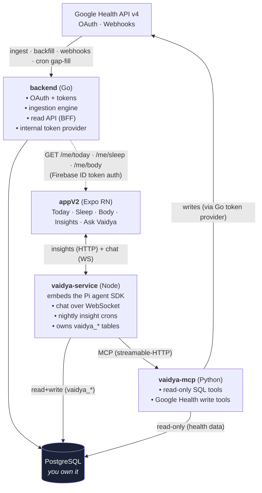
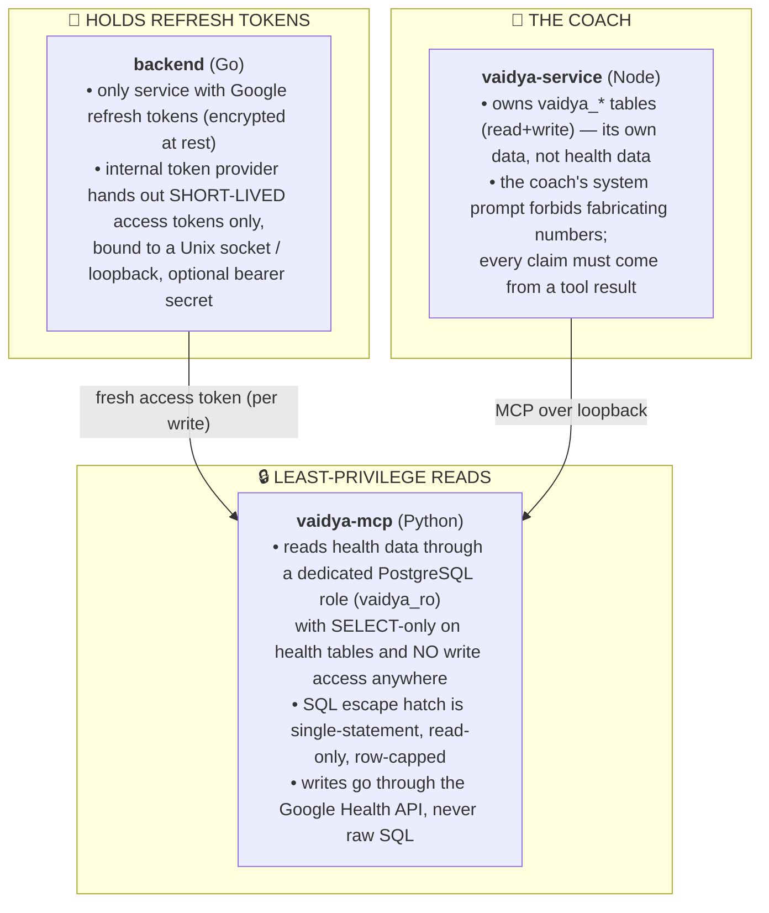

# Architecture

FitVibe is four cooperating services around one PostgreSQL database. This document explains what each does, how data flows between them, and the trust boundaries that keep your health data yours.

## The big picture

## The services

### `backend/` — Go ingestion engine + read API

The heart of the system. It is the only service that talks to Google for ingestion and the only holder of refresh tokens.

- **OAuth & tokens** — exchanges Google authorization codes, stores per-user refresh tokens encrypted at rest, and hands out short-lived access tokens through a `TokenProvider`.
- **Ingestion engine** — every path that pulls data (backfill, cron, webhook processing) funnels DataPoints through one mapper that stores the lossless raw payload as JSONB and extracts typed columns and child rows.
- **Webhooks** — receives real-time Google Health notifications, verifies them, queues them, and processes them asynchronously.
- **Cron gap-fill** — scheduled jobs that fill anything webhooks miss (rollups, profile, reconcile, catch-up, cron-only data types).
- **Read API** — a backend-for-frontend: `GET /me/today`, `/me/sleep/...`, `/me/body`, `/me/profile`, authenticated with Firebase ID tokens.
- **Internal token provider** — an internal-only endpoint (bound to a Unix socket or loopback) that serves *fresh access tokens* (never refresh tokens) to the Vaidya MCP server so it can write to Google Health.

See [backend.md](backend.md).

### `appV2/` — Expo / React Native app

The mobile client. Five surfaces: **Today**, **Sleep**, **Body**, **Insights**, and **Ask Vaidya** (chat). The Today screen is fed by a single aggregate endpoint (`GET /me/today`) through one shared hook. Generative-UI blocks emitted by Vaidya are rendered with a block renderer (charts, rings, Skia canvas). See [app.md](app.md).

### `vaidya-service/` — Node AI coach engine

Embeds the [Pi agent SDK](https://pi.dev) as the coaching engine. Two jobs:

1. **Live chat** over a WebSocket — streams the coach's response token-by-token, plus generative-UI blocks.
2. **Nightly insights** — cron jobs generate a Today headline, per-sleep insights, and an end-of-day report per user, stored as replayable Pi sessions.

It owns the `vaidya_*` tables (chat/insight metadata, push tokens) and reaches health data only through the MCP server. See [vaidya.md](vaidya.md).

### `vaidya-mcp/` — Python MCP tool server

The agent's hands. Exposes [MCP](https://modelcontextprotocol.io) tools:

- **Read tools** — query your health data through a dedicated read-only PostgreSQL role.
- **A SQL escape hatch** — a guarded, read-only single-statement query tool for anything the dedicated tools don't cover.
- **Write tools** — log nutrition, hydration, weight, exercise, etc. back to the Google Health API (using a fresh token from the Go provider).

See [vaidya.md](vaidya.md).

## Data flow

### Ingestion (data in)

1. A user authorizes via Google OAuth (brokered by the backend). The backend stores their encrypted refresh token and a `health_user_id` that ties them to webhook notifications.
2. **Backfill** pulls historical data on first login. **Webhooks** deliver real-time changes. **Cron jobs** fill gaps and handle data types webhooks don't cover.
3. Every DataPoint flows through `ingestion.MapDataPoint`, which:
   - stores the full raw API response in `payload_json` (JSONB, lossless),
   - extracts common scalars into typed columns (`value_count/sum/avg/min/max`, enums, times),
   - promotes a few hot fields to named columns (nutrition carbs/fat, meal type),
   - extracts nested arrays into child tables (sleep stages, exercise splits, nutrients, ECG, …).
4. A `UNIQUE ... NULLS NOT DISTINCT` index makes re-ingestion idempotent, so overlapping fetch windows are safe.

See [data-model.md](data-model.md) for the schema and the dedupe contract.

### Reads (data out to the app)

The app authenticates with a Firebase ID token (the backend mints a Firebase custom token after OAuth, so sign-in is one step). The Today screen calls `GET /me/today`, which assembles the activity summary, nutrition, timeline, and last-night sleep **concurrently** into one response — collapsing four round trips into one. Derived metrics (readiness, sleep score) are computed here from stored data; see [calculations.md](calculations.md).

### Coaching (the AI loop)

1. The app opens a WebSocket to `vaidya-service` (or pulls a pre-generated insight over HTTP).
2. `vaidya-service` drives a Pi agent turn. The agent calls MCP tools to read the user's real data.
3. `vaidya-mcp` answers reads through the read-only role; for writes (logging a meal), it fetches a fresh token from the Go internal provider and POSTs to Google Health.
4. The coach streams back prose tokens and generative-UI blocks, which the app renders.

## Trust boundaries

FitVibe is designed so that the powerful capability (Google account access) and the untrusted-ish capability (an LLM writing SQL) never overlap.

Key properties:

- **The LLM never sees a refresh token.** It gets, at most, a short-lived access token to perform an explicit write.
- **The LLM can't mutate health data via SQL.** Its database role is `SELECT`-only; writes are mediated by the Google Health API.
- **Health data lives in one place you control.** The Vaidya services hold only their own derived metadata.

## Why it's split this way

| Decision | Rationale |
|----------|-----------|
| Go owns ingestion + tokens | One authority for the powerful credential; ingestion is hot-path and benefits from Go's concurrency. |
| One aggregate read endpoint | The app's Today screen needs four things at once; assembling them server-side concurrently beats four mobile round trips. |
| Vaidya is two services | The *engine* (Node + Pi SDK) and its *tools* (Python MCP) have different runtimes and trust levels; splitting keeps the read-only boundary clean. |
| MCP for tools | A standard protocol means the same tools work for the chat engine and the cron insight jobs, and the read-only role is the real security boundary. |
| Lossless `payload_json` | Storing the raw API response means new derived columns can be backfilled from stored data without re-hitting Google. |

## Deployment shape

Everything is built to run on modest hardware (a VPS or Raspberry Pi):

- One PostgreSQL instance.
- The Go backend as a single process (migrations apply on startup).
- The two Vaidya services as separate processes (optional).
- A reverse proxy (e.g. nginx/Caddy) can front the Go backend and `vaidya-service` at one origin in production; in local dev they're separate ports (`:8080` and `:8090`).

See [setup.md](setup.md) for the step-by-step.
