# Data Model

FitVibe stores everything in one PostgreSQL database. The design principle: **keep the raw API response losslessly, and extract typed columns and child rows from it** — so the read API queries columns (fast) while nothing is ever lost (new columns can be backfilled from stored payloads).

Migrations are embedded PostgreSQL DDL in [`backend/internal/db/migrations/`](../backend/internal/db/migrations/), applied in lexical order on server startup. They are idempotent (`IF NOT EXISTS`).

## Core tables

### `users`

Identity, OAuth tokens, profile, and settings.

| Column group | Notable columns |
|--------------|-----------------|
| Identity | `id` (BIGSERIAL PK), `google_user_id` (UNIQUE), `health_user_id` (UNIQUE — the join key to webhook notifications), `legacy_user_id` |
| Tokens | `access_token`, `refresh_token` (**BYTEA, encrypted with Tink**), `token_expiry`, `scopes` |
| Profile | `email`, `google_display_name`, `google_picture`, `google_gender`, `age`, `height_meters`, `weight_kg`, `time_zone`, `utc_offset` |
| Settings | `distance_unit`, `weight_unit`, `height_unit`, `temperature_unit`, `target_bed_minutes`, `target_wake_minutes`, stride lengths |

> The read-only AI role can `SELECT` profile fields but the encrypted token columns are never read by anything but the Go backend.

### `data_points`

The primary table — one row per ingested Google Health DataPoint.

| Column group | Columns |
|--------------|---------|
| Identity | `id` (BIGSERIAL PK), `user_id`, `data_type` (kebab-case) |
| Raw | `payload_json` (**JSONB, lossless** — the full API response) |
| Time | `sample_time`, `start_time`, `end_time` (TIMESTAMPTZ), `civil_start_date` / `civil_end_date` (DATE), `start_utc_offset_seconds` |
| Scalars | `value_count`, `value_sum`, `value_avg`, `value_min`, `value_max`, `enum_value` |
| Promoted | `nutrition_carbs_grams`, `nutrition_fat_grams`, `meal_type`, `food_display_name`, `is_nap` |
| Source | `data_source_family`, `recording_method`, `platform`, `device_name`, `device_form_factor`, `application_package_name` |

### `rollup_data_points`

Hourly and daily aggregates from the Google Health rollup endpoints. Uses **`count_*`** columns (not `value_*`): `count_sum/avg/min/max`, plus `distance_meters_sum`, `energy_kcal_sum`, `duration_seconds_sum`, and `window_size` (e.g. `"3600s"` or `"1d"`).

### `health_data_records`

A normalized per-day metric surface: `(user_id, record_date, metric_name, metric_value, metric_unit, source, data_type)`. The cleanest table for "one number per day" reads (e.g. daily resting HR, a computed score). Unique on `(user_id, record_date, metric_name, source)`.

### `sync_state`

Watermark tracking: the last synced window per `(user_id, data_type, source)` where `source` is one of `list | rollUp | dailyRollUp | catchup | reconcile`. Each syncer resumes from its own watermark.

### `webhook_notifications`

The queue between webhook receive and process: `notification_json`, `signature_header`, `processing_status` (`pending` → `processed`), `retry_count`, `next_retry_at`.

## Child tables

Nested arrays inside a DataPoint are extracted into child tables, each with a foreign key to `data_points(id)` and `ON DELETE CASCADE`:

| Child table | Source data type | Holds |
|-------------|------------------|-------|
| `sleep_stages` | sleep | Chronological stage blocks (Deep/REM/Light/Awake) |
| `sleep_summary_stages` | sleep | Per-stage roll-up (minutes, count) |
| `sleep_out_of_bed_segments` | sleep | Out-of-bed intervals |
| `exercise_splits` | exercise | Split/lap segments |
| `exercise_events` | exercise | Event timeline (lap markers) |
| `nutrition_log_nutrients` | nutrition-log | Nutrient breakdown (PROTEIN, CARBOHYDRATES, …) |
| `daily_heart_rate_zones` | daily-heart-rate-zones | Zone min/max BPM |
| `active_minutes_by_level` | active-minutes | Minutes by activity level |
| `electrocardiogram_waveforms` | electrocardiogram | ECG result, BPM, waveform samples |
| `irregular_rhythm_alert_windows` | irregular-rhythm-notification | Alert windows + heart beats |

Reference tables `food_items` and `food_measurement_units` cache the food database.

## The upsert / dedupe contract

This is the load-bearing invariant that makes ingestion safe to repeat.

A data point's identity is:

```
(user_id, data_type, sample_time, start_time, end_time)
```

enforced by a `UNIQUE ... NULLS NOT DISTINCT` index. PostgreSQL normally treats `NULL`s as distinct; `NULLS NOT DISTINCT` (Postgres 15+) means rows whose NULL time columns match **collide as intended** — the native replacement for the old SQLite `COALESCE(col,'')` trick.

`DataPointRepo.InsertMany` uses:

```sql
INSERT ... ON CONFLICT (...) DO UPDATE ... RETURNING id
```

so the **row id is preserved** on re-ingestion (child-table foreign keys stay valid) and is read back to re-write child rows in the same statement.

**Why this matters:**

- **Overlapping fetch windows are safe.** The catch-up syncer deliberately overlaps its window by `CATCHUP_LOOKBACK_HOURS`, relying on this dedupe to recover missed webhooks without creating duplicates.
- **Re-ingestion is idempotent.** Running `cmd/fetchbackfill` again, or reprocessing a webhook, updates in place.
- **Mapper changes can be replayed.** `cmd/backfill` re-runs the mapper over stored `payload_json` to recompute extracted columns — no API calls.

The same idea applies to `rollup_data_points` (its own `NULLS NOT DISTINCT` constraint over the rollup key).

```mermaid
gantt
    title Overlapping fetch windows are safe — idempotent upsert dedupes the overlap
    dateFormat HH
    axisFormat %Hh
    section Fetch
    Window A          :a, 00, 12h
    Window B          :b, 09, 12h
    section Overlap
    Re-inserted rows  :crit, 09, 03h
```



The overlap window (`CATCHUP_LOOKBACK_HOURS`) re-inserts the same rows; `ON CONFLICT DO UPDATE` means no duplicates and row ids are preserved.

## Time handling

- Instants are stored in `TIMESTAMPTZ` as UTC.
- Local wall-clock is reconstructed by applying the stored `start_utc_offset_seconds` to the instant — the device's own offset, not the server's.
- Per-day grouping ("Today", a sleep night's civil date) keys on the `civil_start_date` DATE column, **never** on a raw instant — so a workout at 11pm local lands on the right local day regardless of server timezone.

## The `vaidya_*` tables

The Vaidya service owns a small set of its own tables (created idempotently by `vaidya-service` on startup, **not** by the Go migrator):

| Table | Holds |
|-------|-------|
| `vaidya_insights` | One row per generated insight: `type` (`sleep` / `today_insight` / `day_insight`), `civil_date`, optional `sleep_data_point_id`, and a `pi_session_id`. The rendered content is recovered by **replaying the Pi session**, so only the session id + metadata are stored. Unique on `(user_id, type, civil_date, sleep_data_point_id)` with `NULLS NOT DISTINCT`. |
| `vaidya_push_tokens` | Expo push tokens, one per device (multiple per user); `token` is UNIQUE so re-registering a device upserts. |

These hold only Vaidya's own derived metadata — never health data, which it reads through the MCP server. See [vaidya.md](vaidya.md).
