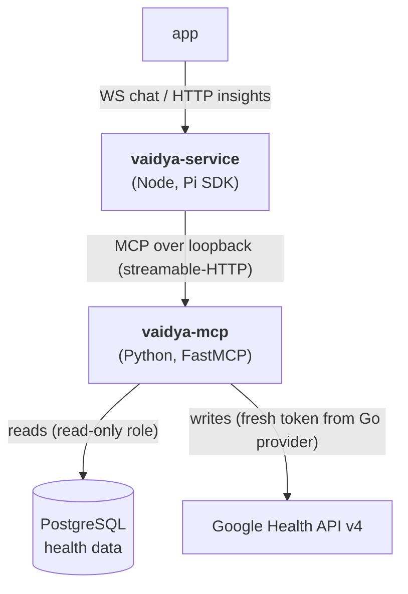

# Vaidya — the AI Health Coach

Vaidya ("a practitioner of healing") is FitVibe's AI coach. It answers questions and writes daily insights using **only the user's real data** — never fabricated numbers. It is split into two services:

- **[`vaidya-service/`](../vaidya-service/)** — the **engine** (Node + the [Pi agent SDK](https://pi.dev)): live chat over WebSocket and cron-generated insights.
- **[`vaidya-mcp/`](../vaidya-mcp/)** — the **tools** (Python + [FastMCP](https://github.com/jlowin/fastmcp)): read-only SQL over health data + write-back to Google Health.

Both are optional — the backend + app work without them.



## `vaidya-service` — the coach engine

**Stack:** Node 22 · TypeScript · `@earendil-works/pi-coding-agent` (the Pi SDK) · Fastify · `ws` · `node-cron` · `pg` · `expo-server-sdk` · `firebase-admin`.

### How it embeds Pi

The Pi SDK *is* the coaching loop — the service does not hand-roll an LLM tool-call loop. [`src/pi/agent.ts`](../vaidya-service/src/pi/agent.ts) builds a session that wires:

- the model (Claude Opus 4.8 by default, via Anthropic OAuth — config-switchable),
- the per-task **system prompt** (`src/prompts/*.md`),
- the **MCP tools** (via the `pi-mcp-adapter` extension, which connects to `vaidya-mcp` at `http://127.0.0.1:8765/mcp`),
- the **`vaidya-health-schema` skill** (the exact DB schema, loaded before the agent writes SQL),
- the **generative-UI tools** (`emit_block` / `emit_canvas`).

The tool allow-list is restricted to `read`, `mcp`, and the `emit_*` tools — **no** bash/write/edit, so the coach can't shell out or touch the filesystem.

### Chat over WebSocket

`/vaidya/chat` ([`src/ws/chat.ts`](../vaidya-service/src/ws/chat.ts)), authed with a Firebase ID token (query param), resumable with `?conversationId=`. Inbound: `{ message, attachments? }`. Outbound frames:

| Frame | Meaning |
|-------|---------|
| `ready` | The session id (for resume). |
| `token` | A streamed chunk of the coaching answer. |
| `tool` | A tool call started (drives the "working" indicator and message splitting in the app). |
| `block` | A generative-UI block emitted this turn. |
| `done` | Turn complete. |
| `error` | Something failed. |

**Plumbing stays hidden.** The server buffers assistant text and **discards any segment immediately followed by a tool call** — that text is the model's internal planning ("let me check…"), not coaching. Only the final answer segment is streamed. The system prompt reinforces this: the coach must never mention tools, SQL, schemas, or `user_id`.

### Nightly insights (cron)

Three jobs ([`src/cron/jobs.ts`](../vaidya-service/src/cron/jobs.ts)), each per-user and respecting the user's local civil day:

| Job | Schedule | Generates |
|-----|----------|-----------|
| **sleep-watch** | every 30 min | A per-sleep insight for each new sleep session that doesn't have one yet. |
| **today-headline** | every 3 h | A fresh two-line "where you stand right now" headline (replaces the day's prior). |
| **day-report** | nightly (~23:00 local) | One detailed end-of-day report — correlations, trends, flags — gated on the day's sleep having synced. |

Each insight is generated by a Pi session whose id is stored in `vaidya_insights`. The rendered blocks are recovered later by **replaying the session** ([`src/pi/replay.ts`](../vaidya-service/src/pi/replay.ts)) — so only the session id + metadata are persisted, not a frozen copy of the content. After generating, the job pushes a notification to the user's devices.

### HTTP endpoints

Fastify ([`src/http/server.ts`](../vaidya-service/src/http/server.ts)), all Firebase-authed:

| Endpoint | Purpose |
|----------|---------|
| `GET /vaidya/insights/today` | Latest today headline. |
| `GET /vaidya/insights/sleep/:date?` | Latest (or dated) per-sleep insight. |
| `GET /vaidya/insights/day/:date?` | Latest (or dated) day report. |
| `GET /vaidya/conversations` | Recent chat sessions (last 7 days). |
| `GET /vaidya/conversations/:id/messages?limit=` | Messages of one conversation. |
| `POST /vaidya/push/register` · `/unregister` | Expo push-token registration. |
| `GET /healthz` | Health check. |

### Generative UI blocks

The agent composes its answer as prose plus `emit_block` / `emit_canvas` tool calls ([`src/tools/blocks.ts`](../vaidya-service/src/tools/blocks.ts), validated with zod). The block kinds mirror the app's renderer: composite cards (`today_headline`, `sleep_insight`, `day_summary`, `insight_card`), primitive evidence (`hypnogram`, `sparkline`, `bars`, `ring`, `stat_tile`, `stat_tile_grid`, `readiness_card`, `recovery_signals`, `streak_dots`, `micro_bars`, `badge`), and the `canvas` Skia escape hatch. A `BlockCollector` accumulates them in order for the WS/cron caller to read after the turn.

### Pi skills

Under [`.pi/skills/`](../vaidya-service/.pi/skills/):

- **`vaidya-health-schema`** — the exact Postgres schema (tables, columns, kebab-case data-type values, civil-date conventions). The agent loads this *before* writing any `query_health_db` SQL.
- **`vaidya-ui-blocks`** — the exact block shapes for `emit_block`, loaded before emitting visuals.

### Config

[`vaidya-service/.env.example`](../vaidya-service/.env.example): `DATABASE_URL` (required — it owns the `vaidya_*` tables), `PORT` (8090), `VAIDYA_MODEL_PROVIDER` / `VAIDYA_MODEL_ID`, optional `FIREBASE_*`. The model uses Anthropic OAuth (Pi reads `~/.pi/agent/auth.json`), not an API key.

```bash
cd vaidya-service && npm install && npm run dev   # :8090
```

## `vaidya-mcp` — the tool server

**Stack:** Python 3.11 · FastMCP (streamable-HTTP) · psycopg · httpx. Started with `python -m vaidya_mcp.server`, serving `http://127.0.0.1:8765/mcp`.

### Read tools

Query health data through the **read-only role** (see below):

| Tool | Returns |
|------|---------|
| `ping()` | Health check / connectivity. |
| `get_today_summary(user_id)` | Today's steps, distance, floors, active energy, zone minutes (user's local day). |
| `get_nutrition(user_id, date?)` | Calories, macros, hydration for a civil day. |
| `get_sleep(user_id)` | Most recent main sleep — time asleep + stage breakdown. |
| `query_health_db(sql)` | **SQL escape hatch** — a single read-only `SELECT`/`WITH`, rows capped at 200. |

### Write tools

Each fetches a fresh Google access token from the Go internal provider and POSTs to the Google Health API v4. Manually-loggable types only:

`log_hydration`, `log_nutrition`, `log_weight`, `log_body_fat`, `log_height`, `log_exercise`, `log_sleep`.

Written data syncs back into PostgreSQL via the Go ingestion pipeline on the next sync. The exact write JSON is documented in [google-health-write-payloads.md](google-health-write-payloads.md).

### The read-only role (the security boundary)

[`vaidya-mcp/sql/role_provisioning.sql`](../vaidya-mcp/sql/role_provisioning.sql) creates `vaidya_ro`: `SELECT` on the health tables only, with **all** `INSERT`/`UPDATE`/`DELETE`/`TRUNCATE`/DDL explicitly revoked and no default-privilege grant (fail-closed — new tables are inaccessible until explicitly granted). The SQL escape hatch adds defense-in-depth: statement validation (single read-only statement), a read-only transaction, a row cap, and a timeout. Run the provisioning SQL once as a superuser.

### How writes get a token

Google is reached only with a **short-lived access token** fetched per write from the Go internal token provider ([backend.md](backend.md#internal-token-provider)) — over a Unix socket (prod) or loopback (dev), with an optional bearer secret. The MCP server never holds a refresh token.

### Config

[`vaidya-mcp/.env.example`](../vaidya-mcp/.env.example): `DATABASE_URL_READONLY` (required — the `vaidya_ro` DSN), `GO_TOKEN_SOCKET` **or** `GO_TOKEN_URL`, `INTERNAL_TOKEN_SECRET`, `GOOGLE_HA_BASE`.

```bash
cd vaidya-mcp
python -m venv .venv && .venv/bin/pip install -e .
psql "$DATABASE_URL" -f sql/role_provisioning.sql   # once, as superuser
python -m vaidya_mcp.server                          # http://127.0.0.1:8765/mcp
.venv/bin/pytest -q                                  # tests
```

## System prompts

[`vaidya-service/src/prompts/`](../vaidya-service/src/prompts/): `chat.md` (live coaching — grounded, evidence-based, never reveals tooling), `today.md` (the two-line headline), `sleep.md` (per-session interpretation → a `sleep_insight` block), `day.md` (the correlation-hunting end-of-day report → `insight_card` blocks).

For the deeper research and architecture rationale, see [vaidya-research.md](vaidya-research.md).
